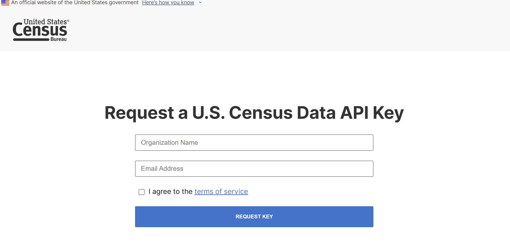
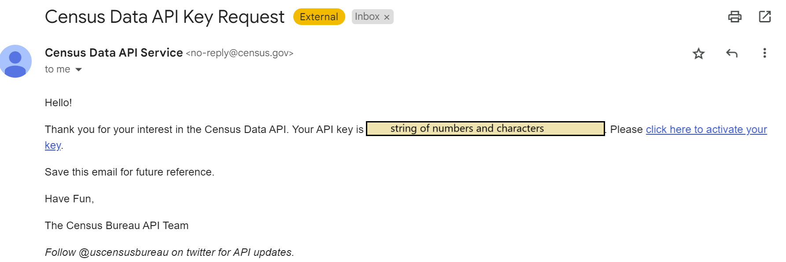

# Tutorial: How to get a Census API Key up and running
 
 This is a tutorial on how to get a Census API key and use it with the URL feature. It is written with UCI folks in mind, but it should work for anyone.

  _(Already have a working API key? skip to [Step 3](#step-3-use-the-key)_

 **Why?**

The U.S. Census Bureau offers some of its public data online. It is often difficult to get detailed data without running into limitations. If you use their data explorer tool, the "Detailed Profiles" are often actually limited in details. Using an FTP program means you have to download a ton of starting data, even if you are looking for a specific, narrow dataset.

Simply put, raw Census data gathering is known to be a pain in the ass. If it wasn't, [this fiverr gig](https://www.fiverr.com/s/EgYBQG9) wouldn't exist.

Thankfully, there are ways to access the data in machine-readable format via  an Application Programming Interface ("**API**") key[^A]. Once you have an API key, you can extract raw statistical data from all sorts of Census Bureau surveys and programs[^C], and even with tools you might already use, like...
- JSON (ArcGIS uses REST APIs)
- R  ([tigris](https://github.com/walkerke/tigris))
- Python ([Pygris](https://walker-data.com/pygris/))

Perhaps the simplest way to use the API key, however, is to type a query string into the URL of a Web browser [^B]. That is what we're doing today.

**Estimated time**: 10 minutes

**What you'll need**:
- [x] Access to the Internet
- [ ] A working email address
- [ ] Mozilla Firefox OR Google Chrome browser[^1]

**What you'll do**:
- [ ] Request an API Key
- [ ] Activate the API Key
- [ ] Get results from a query in your web browser

## Step 1. Request a key


_Figure 1: Web Form to Request a Census Data API Key_  

1. Go to [Request a U.S. Census Data API Key](https://api.census.gov/data/key_signup.html).
2. Read the [Terms of service](https://www.census.gov/data/developers/about/terms-of-service.html) linked in the last field before the submit button.
	- Summary: When getting information from Census Bureau data, attribute the data whenever you use it and use it in ways that do not violate geoprivacy, etc.
3. Fill out the form
	1. I entered  `University of California, Irvine` for organization
	2. Any email address should work. I used my UCI email address
	3. Check the box to agree. 
4. Press "Request Key".

## Step 2. Activate the key

After submitting, you should almost immediately receive an email with subject line, "Census Data API Key Request".

_Figure 2: Screenshot of activation email from Census Bureau_  

I censored the part with my own key, but it a 40-character string of numbers and letters, which I'll refer to henceforth as  `stringofcharactersandnumbers`.

Until you click the link in this email, the key will not work yet!

Click "Click here to activate your key".

If you got this result, then proceed to [Step 3](#step-3-use-the-key)

> **Success**
> 
> Your request for a new API key has been successfully submitted. Please check your email. In a few minutes you should receive a message with instructions on how to activate your new key.

<details>
<summary><strong>Troubleshooting if you got this error message (Click to expand)</strong><br/><br/>
<blockquote><strong>Error</strong><br/>
You've attempted to validate an unknown key. If it has been more than 48 hours since you submitted your request for this API key then the request has been removed from the system. Please request a new key and activate it within 48 hours.
</blockquote></summary>

<p>A possible explanation for the error:</p>

<p>If you used your UCI email address (or similar institution's address), there were changes made to the activation link via <a href="https://www.oit.uci.edu/services/communication-collaboration/proofpoint/">Proofpoint Email Security</a>. The process is shown in Figure 3 here, using an address to Reddit as an example, where you can still identify the original link in the mess on the right:</p>

<figure>
<br/>
 <figcaption><em>Figure 3: Example sequence of a link getting modified through Proofpoint email security process. Note: the result URL is similar to the real output, but this is fake and for demonstration purposes.</em> </figcaption></figure><br/><br/>
 
<p> Apply the same observation to the link sent to your email:</p>
<ol>
	<li>Right click the link text "click here to activate your key". Select "Copy link address"</li>
	<li>Paste the URL in a text editor and assess: If the address been modified, you may be able to find the original URL, which should begin with <code>https....</code> and end with a string of numbers and letters that matches the key in your email (before <code>__;!!</code>). Can you identify it?
		<ul>
			<li>Yes &rarr; Highlight and copy the original URL. Paste into your browser's address bar and go. You should see the success message now. Proceed to next step.</li>
			<li>No &rarr; Email/Slack me for help. Make sure to include what browser/version you are using. </li>
		</ul>
</ol>

</details>

## Step 3. Use the key

Now that your API key has been activated, let's see if this works.

One of the easiest ways is by simply using it on URLs, or through the website. When doing a web call, there is no software or program needed. You just specify your request in a URL and get the result, all in your web browser. Let's try it now. It really is as simple as starting with a sample URL, and then editing that URL to get the data that you're looking for[^C]

1. Copy this link 
`https://api.census.gov/data/2020/dec/dp?get=NAME&DP1_0001C&for=state:*&key=stringofcharactersandnumbers`
2. Paste the link into your web browser, but do not press enter/go.
3. Replace the last part after the equals sign in `key=stringofcharactersandnumbers` with your API key.
4. Press enter/navigate to the address. You should be directed to plain text formatted data. Expand the accordion below to check. If it is the same, then congrats! You just pulled Census data with the API key.

<details>
<summary>Click to see contents of <code>get=NAME&DP1_0001C&for=state:*</code></summary>

```
[["NAME","DP1_0001C","state"],
["Alabama","5024279","01"],
["Alaska","733391","02"],
["Arizona","7151502","04"],
["Arkansas","3011524","05"],
["California","39538223","06"],
["Colorado","5773714","08"],
["Connecticut","3605944","09"],
["Delaware","989948","10"],
["District of Columbia","689545","11"],
["Florida","21538187","12"],
["Georgia","10711908","13"],
["Hawaii","1455271","15"],
["Idaho","1839106","16"],
["Illinois","12812508","17"],
["Indiana","6785528","18"],
["Iowa","3190369","19"],
["Kansas","2937880","20"],
["Kentucky","4505836","21"],
["Louisiana","4657757","22"],
["Maine","1362359","23"],
["Maryland","6177224","24"],
["Massachusetts","7029917","25"],
["Michigan","10077331","26"],
["Minnesota","5706494","27"],
["Mississippi","2961279","28"],
["Missouri","6154913","29"],
["Montana","1084225","30"],
["Nebraska","1961504","31"],
["Nevada","3104614","32"],
["New Hampshire","1377529","33"],
["New Jersey","9288994","34"],
["New Mexico","2117522","35"],
["New York","20201249","36"],
["North Carolina","10439388","37"],
["North Dakota","779094","38"],
["Ohio","11799448","39"],
["Oklahoma","3959353","40"],
["Oregon","4237256","41"],
["Pennsylvania","13002700","42"],
["Rhode Island","1097379","44"],
["South Carolina","5118425","45"],
["South Dakota","886667","46"],
["Tennessee","6910840","47"],
["Texas","29145505","48"],
["Utah","3271616","49"],
["Vermont","643077","50"],
["Virginia","8631393","51"],
["Washington","7705281","53"],
["West Virginia","1793716","54"],
["Wisconsin","5893718","55"],
["Wyoming","576851","56"],
["Puerto Rico","3285874","72"]]
```

</details>

### What did we just do?

Let's look at the URL again to take a closer look at the dataset specification and variables.

The schematic below breaks down the components of the API URL query. The variable list includes the variable(s) you are requesting. 


_Figure 4: Decoding an API URL address: Components of a Census Data API URL query_  

Table explaining variables
| Part | Phrase | Component | Description |
|--|--|--|--|
| Specified Dataset | `"2020/dec/dp"` | `2020`| Year |
| | | `dec` | Decennial Census |
| | | `dp`| Detailed Profile |
| Get? or Variable | `"NAME"` | `for=`| is a predicate clause |
| | | `NAME` | provides the name of the geographic area(s) that you are using to limit your search |
| Variable  |`"DP1_0001C"` | `DP1` | Data Profile Table 1 |
| | | `0001C` | 1 is column 1, and C is the third row. Total population count |
| Predicate | `"for=state*"`| `for=` | is a predicate clause |
| | | `state*` | is a geography, which specifies the geographic area(s) of interest. The asterisk * returns all states. |

Here is what we find: 
-   Data set source specified by `2020/dec/dp` which refers to the 2020 Decennial Census Detailed Profile (hence, "dec" and "dp")
-  Variables. You can include up to 50 variables in a single API query (separated by commas). In this data set:
	- `NAME` provides the name of the geographic area(s) that you are using to limit your search.
	- `DP1_0001C` variable specifies total population. It is a count (not standardized or normalized). The letter C means we're on the 3rd row of a table containing a bunch of population observations (1 = men, 2 = women, I think)
	- `for=state*` has a couple things going on.
		- `for`  is a predicate clause, which specifies how variables should be filtered or limited (for example, for certain geographic areas).
			- The asterisk here returns all states. If you wanted to limit it to California, you would write 06.
		-  `state` is a geography, which specifies the geographic area(s) of interest.

Notice how you can search for the exact variables and geographies that you're looking for, and there is no need to store any data or make intermediate products to narrow down to the results you want.  You can also access way more data than what you can find on data.census.gov, and you don't have to use the file transfer protocol (FTP) either. For example, download a bunch of rows in an example.

Verify some numbers like for California.

## Next Steps

Now, for the assignment! 

[^A]: U.S. Census Bureau (July 30 2024). [Census Data API User Guide Website](https://www.census.gov/data/developers/guidance/api-user-guide.html)  or view the [PDF version](https://www.census.gov/content/dam/Census/data/developers/api-user-guide/api-user-guide.pdf). 
[^B]:  U.S. Census Bureau (February 2020). [Using the Census Data API With the American Community Survey: What Data Users Need to Know](https://www.census.gov/content/dam/Census/library/publications/2020/acs/acs_api_handbook_2020.pdf),  U.S. Government Printing Office, Washington, DC. 
[^C]: [Transcript, Demystifying the Census API Transcript](https://www2.census.gov/about/training-workshops/2020/2020-07-22-cedcsi-transcript.pdf) (pdf). 22 July 2020.
[^1]: According to [this 2020 Census guide](https://www.census.gov/content/dam/Census/library/publications/2020/acs/acs_api_handbook_2020.pdf), Firefox and Chrome provide the functionality to view the results from API queries in all Web browsers, so users who do not use these may not be able view them.

---

This is a one page course template was made with [Docsify-This.net](https://docsify-this.net/#/). Markdown draft in [StackEdit](https://stackedit.io/).

Tutorial by Thi Truong is licensed under [CC BY 4.0](http://creativecommons.org/licenses/by/4.0).

